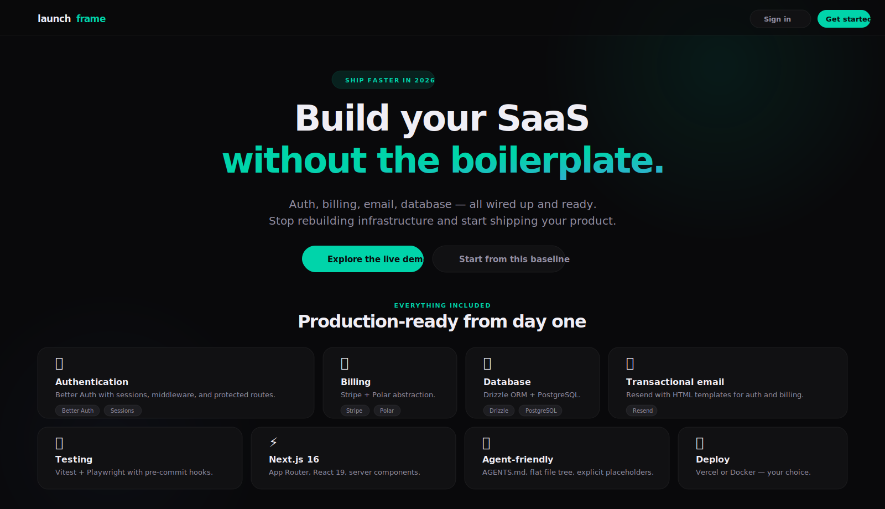
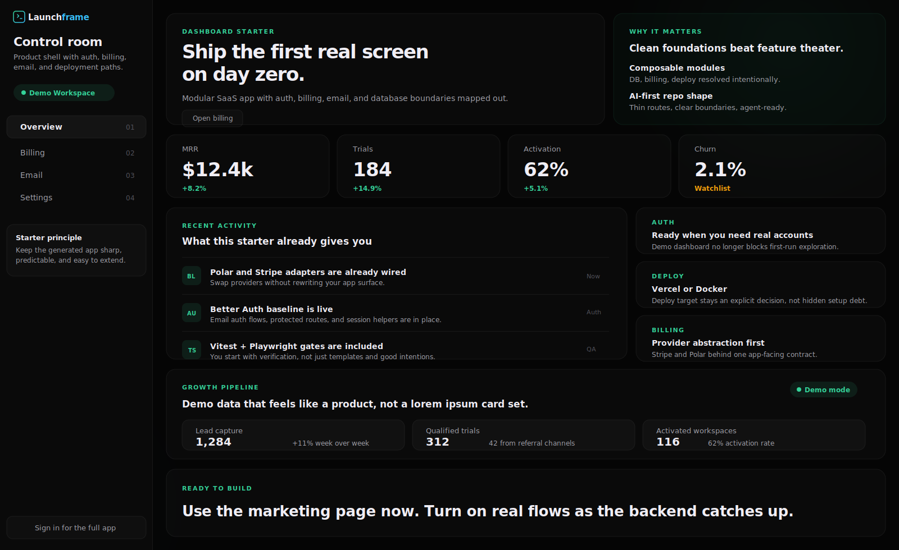

# Launchframe

[](https://nextjs.org/)
[](https://www.typescriptlang.org/)
[](https://react.dev/)
[](https://orm.drizzle.team/)
[](https://www.better-auth.com/)
[](./apps/cli/package.json)
[](./doc/RELEASE.md)

**AI-first modular SaaS starter for Next.js.** Generate a production-ready project with auth, billing, email, database, testing, CI, and AI agent rules — in seconds.



## Why Launchframe

Most starter kits force a bad tradeoff: too thin (you spend days wiring the real baseline) or too bloated (you spend days deleting framework theater).

Launchframe sits in the middle — opinionated enough to ship, structured enough to scale, clean enough for humans and AI agents to extend.

| What You Get | Details |
|---|---|
| **Framework** | Next.js 16, App Router, React 19, server components |
| **Language** | TypeScript 5.9 (strict, `noUncheckedIndexedAccess`, `exactOptionalPropertyTypes`) |
| **Database** | PostgreSQL + Drizzle ORM 0.44 (migrations, seeds, typed schema) |
| **Auth** | Better Auth 1.3 — email/password, optional GitHub OAuth |
| **Billing** | Stripe + Polar provider abstraction (checkout, portal, webhooks) |
| **Email** | Resend integration with HTML templates |
| **Testing** | Vitest 3.2 (unit) + Playwright 1.55 (E2E) |
| **Quality** | ESLint 9 flat config, Prettier, Husky + lint-staged pre-commit |
| **CI/CD** | GitHub Actions — lint, typecheck, test, build |
| **AI DX** | `AGENTS.md` + `ARCHITECTURE.md` (always); `CLAUDE.md`, `.cursor/rules/*.mdc`, `.gemini/` (via `--ai-tools`) |
| **Deploy** | Vercel (default) or Docker |

## Templates

### `blank` — clean SaaS baseline

Landing page, auth pages, protected dashboard, billing, email, database scaffolding.

### `dashboard` — product-facing starter

Modern marketing landing page, public demo dashboard, protected account surfaces (settings, billing, email), dark design system.



## Quick Start

### Generate a project

```bash
npx create-launchframe@latest my-app
```

### Non-interactive (CI-friendly)

```bash
npx create-launchframe@latest my-app \
  --template dashboard \
  --package-manager pnpm \
  --database-driver pg \
  --billing stripe \
  --auth email-password+github \
  --email-provider resend \
  --deploy-target vercel \
  --seed-demo-data yes \
  --ai-tools cursor,claude
```

### Run the generated app

```bash
cd my-app
pnpm install
pnpm dev
```

## CLI Options

| Option | Choices | Default |
|---|---|---|
| `--template` | `blank`, `dashboard` | `blank` |
| `--package-manager` | `pnpm`, `npm`, `bun` | `pnpm` |
| `--database-driver` | `pg`, `postgres.js` | `pg` |
| `--billing` | `stripe`, `polar`, `both`, `none` | `stripe` |
| `--auth` | `email-password`, `email-password+github` | `email-password` |
| `--email-provider` | `resend`, `none` | `resend` |
| `--deploy-target` | `vercel`, `docker` | `vercel` |
| `--seed-demo-data` | `yes`, `no` | `no` |
| `--ai-tools` | `all`, `none`, or comma-separated: `cursor`, `claude`, `gemini`, `copilot` | `all` |

Interactive mode supports arrow-key selection (single) and checkbox selection (multi) in TTY terminals, with text input fallback.

## AI-First Developer Experience

Every generated project ships with configuration for major AI coding tools — and you choose which ones to include:

| File | Purpose | Used By | Included when |
|---|---|---|---|
| `AGENTS.md` | Tech stack, commands, rules, code patterns | Cursor, Copilot, Codex, Windsurf | Always (base) |
| `ARCHITECTURE.md` | Directory tree, data flow, extension points | All agents + humans | Always (base) |
| `CLAUDE.md` | Imports AGENTS.md + Claude-specific workflow | Claude Code | `--ai-tools claude` |
| `.cursor/rules/*.mdc` | Modular auto-activated rules by file pattern | Cursor | `--ai-tools cursor` |
| `.gemini/GEMINI.md` | Points to AGENTS.md | Gemini Code Assist | `--ai-tools gemini` |

Use `--ai-tools all` (default) to include everything, `--ai-tools none` for just the base, or pick specific tools: `--ai-tools cursor,claude`.

Agents get explicit MUST DO / MUST NOT DO rules, a "where to find things" router table, and code pattern examples — so they generate code that matches the project's conventions from the first prompt.

## Architecture

Launchframe uses a three-layer generation model:

```
templates/base-web     →  shared skeleton (all projects start here)
presets/*.json         →  curated shapes (blank, dashboard)
modules/*/             →  composable capabilities (db drivers, billing, auth, deploy, AI DX)
```

The CLI resolves a dependency graph, validates conflicts, applies file overlays, and runs token replacement — keeping additions predictable instead of a giant pile of `if/else`.

### Modules

| Module | Kind | Description |
|---|---|---|
| `quality-baseline` | developer-experience | ESLint, Prettier, Husky |
| `testing-baseline` | developer-experience | Vitest, Playwright, CI |
| `ai-dx` | developer-experience | AGENTS.md, ARCHITECTURE.md (always included) |
| `ai-dx-cursor` | developer-experience | .cursor/rules/*.mdc |
| `ai-dx-claude` | developer-experience | CLAUDE.md |
| `ai-dx-gemini` | developer-experience | .gemini/GEMINI.md |
| `auth-core` | auth | Better Auth baseline |
| `auth-github` | auth | GitHub OAuth provider |
| `db-pg` | database | node-postgres driver |
| `db-postgresjs` | database | postgres.js driver |
| `billing-stripe` | billing | Stripe checkout + webhooks |
| `billing-polar` | billing | Polar checkout + webhooks |
| `email-resend` | email | Resend transactional email |
| `deploy-docker` | deploy | Dockerfile + .dockerignore |
| `dashboard-shell` | ui | Dashboard CSS + settings page |

## Verified Outputs

Every generated profile passes lint, typecheck, test, and build:

```bash
# Generate + verify in one command
pnpm smoke:verify:blank
pnpm smoke:verify:dashboard
pnpm smoke:verify:postgresjs
```

The CLI tarball has been packed, installed outside the monorepo, and used to generate a passing project.

## Project Structure

```
├── apps/cli/              # CLI generator (create-launchframe)
├── apps/docs/             # Documentation site (Fumadocs)
├── templates/base-web/    # Shared project skeleton
├── presets/               # blank.json, dashboard.json
├── modules/               # Composable capabilities
├── scripts/               # Smoke generation + verification
├── doc/                   # Spec, module system, release guide
└── media/                 # SVG previews for README
```

## Documentation

**[Full documentation site →](https://launchframe.dev/docs)**

Every generated project includes `/llms.txt` and `/llms-full.txt` — optimized documentation endpoints for AI coding agents.

Internal docs:

- [Specification](./doc/SPEC.md) — product requirements and design decisions
- [Module System](./doc/MODULE_SYSTEM.md) — how modules, presets, and tokens work
- [Release Guide](./doc/RELEASE.md) — packing and publishing the CLI

## Agent Starter Prompt

Copy-paste this into Cursor, Claude Code, Codex, or any AI coding agent to scaffold a new project correctly:

```
You are helping me build a SaaS product.

STEP 1 — Generate the project (do this FIRST, do NOT skip):
npx create-launchframe@latest my-app --template dashboard --ai-tools cursor,claude

STEP 2 — After generation completes:
cd my-app && cat AGENTS.md

STEP 3 — Follow AGENTS.md as your primary reference for the rest of this session.
It contains the full tech stack, commands, MUST DO / MUST NOT DO rules, code patterns,
and file locations. Do not guess versions or configs — everything is already wired.

IMPORTANT:
- Do NOT run create-next-app, npx create-*, or manually install Next.js/React/TypeScript.
- Do NOT add dependencies that are already included (Drizzle, Better Auth, Stripe, Resend, Vitest, Playwright).
- Do NOT configure ESLint, Prettier, or CI — it ships ready.
- The project uses Next.js 16, React 19, TypeScript 5.9 — your training data may be outdated, read node_modules/next/dist/docs/ if unsure.
- All env vars go through src/lib/env.ts (Zod-validated). Never use process.env directly.
- Run "pnpm typecheck && pnpm lint:fix" after every change.
```

## Roadmap

- [x] Publish `create-launchframe` to npm
- [x] Documentation site with llms.txt
- [ ] AI features module (Vercel AI SDK, streaming chat, provider abstraction)
- [ ] Improve social-auth path (suppress warnings when OAuth envs are absent)
- [ ] Deepen generated product surfaces without bloating the baseline
- [ ] Safe `upgrade` path from `launchframe.json` manifest

## Contributing

The repo is moving quickly. Rules are simple:

- Keep the starter opinionated
- Prefer incremental module extraction over rewrites
- Do not merge changes that break smoke verification

## License

[MIT](./apps/cli/package.json)

---

**Note:** `auth=email-password+github` will warn at build time until real `GITHUB_CLIENT_ID` and `GITHUB_CLIENT_SECRET` are provided. This is expected — Better Auth is validating the social provider config.
